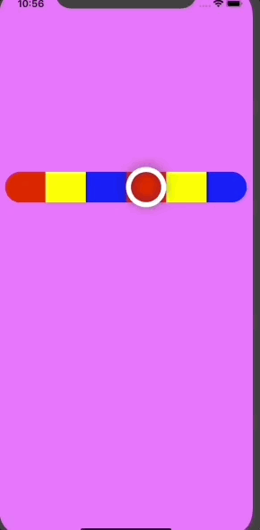

# CustomGradientation

It's a Custom Slider View (Made using Only "UIViews") which has 2 varients
1) Distinct colors gradient
2) A blended Colors gradient

You can also change the stroke color and size of your slider thumb and even its shadow 
By Overriding the method in draw() of CustomSliderView    i.e.  "createKnobForSlider( )"

    func createKnobForSlider(strokeColor : UIColor = .white , strokeWidth : CGFloat = 0 , backgroundColor : UIColor = .clear,shadowColor : UIColor = .darkGray)
    
    
Below you can check out the distinct color gradient slider in action

Below you can check out the  color gradient slider in action

There are 2 delegate method which gets called when you select a value which gives you index of element  and [color of your currently selected position only for DistinctColorGradient  ] 

    func willSelectElement(index : Int,color : UIColor?)
    @objc optional func didSelectElement(index : Int, color : UIColor?)
